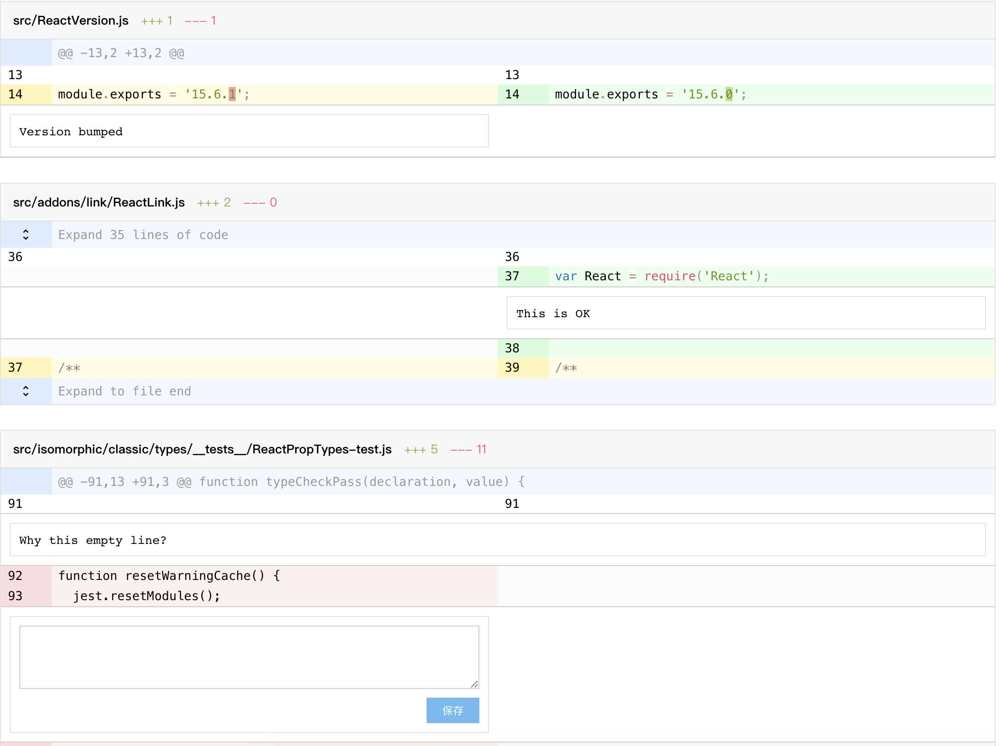
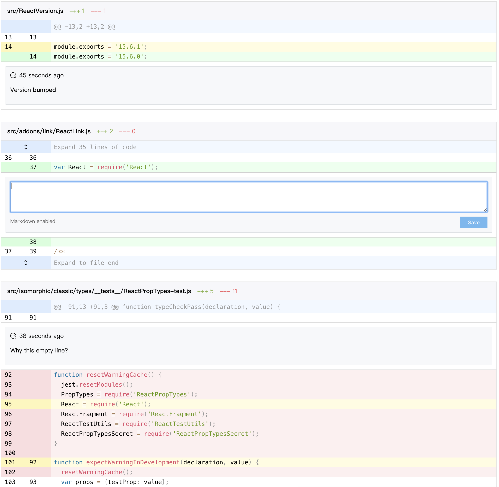

# react-diff-view

A git diff component to consume the git unified diff output.





## Full features

- A clean and small core to display diff.
- Support split (side by side) and unified (one column) views.
- Tolerable performance.
- Code select and highlight.
- Extensible widget architecture to support code commenting and various requirements.
- External syntax highlight support in an easy way.
- Customizable events and styles.

Run `npm start` to enjoy a full featured demo with diff display, collapsed code expansion, code comment and large diff lazy load.

You can modify the `small.diff` to `large.diff` in `demo/App.js` to test the performance, the `large.diff` is a **2.2MB diff file with 375 files changed, 18721 insertions(+), 35671 deletions(-)**, it can possibly hung your computer so use it in caution.

In my laptop (MacBook Pro 15-inch 2016, 2.6 GHz Intel Core i7, 16 GB 2133 MHz LPDDR3) it performs quite slow but tolerable:

```
parse: 88.73291015625ms
render: 26072.791015625ms
paint: 6199.848876953125ms
```

## Install

```shell
npm install --save react-diff-view
```

## Basic usage

### Parsing diff text

For best display effect, you should generate your diff text with `git diff -U1` command.

The `parseDiff` named export is simply a re-export of [parse-diff](https://www.npmjs.com/package/parse-diff) package, it parses the diff text to a reliable object structure, the function returnes a list of file object which is the input of `Diff` component.

The `Diff` named export is a component which accepts a diff file object and correctly display it in either unified or split view, here is the full list of its props:

- `{Array<Chunk>} chunks`: The chunks of diff, simply get it from the `parseDiff` output.
- `{Array<ReactElement>} children`: Instead of passing a list of chunks, you can make each chunk a more customizable `Chunk` component, see [Customize chunk header](#customize-chunk-header) sectionf or its use case.
- `{string} viewType`: Can be either `"unified"` or `"split"` to determine how the diff should look like.
- `{string} className`: An extra css class.
- `{Object} customEvents`: An object containing events for different part, see [Customize events](#customize-events) section for detail.
- `{Object} customClassNames`: An object containing css classes for different part, see [Customize styles](#customize-styles) section for detail.
- `{Array<Change>} selectedChanges`: An array of selected changes, these changes will be highlighted.
- `{boolean} columnDiff`: Whether to enable column diff (show difference bewtween two lines of code), only available when `viewType` is set to `"split"`, it is enabled by default.
- `{number} columnDiffThreshold`: The minimum of string distance when column diff should be enabled, if two string's distance is less than it, column diff are disabled, the default value is `15`.
- `{Function} onRenderCode`: Callback when code is rendered, can be used to further manipulate the DOM element containing code, see [Syntax highlight](#syntax-highlight) section for detail.
- `{Array} widgets`: An array of `{change, element}` object to add widget for changes, see [Add widgets](#add-widgets) section for detail.

A basic use case is to pass `chunks` and `viewType` prop to `Diff` component, the diff will be rendered:

```javascript
import {parseDiff, Diff} from 'react-diff-view';

const App = ({diffText}) => {
    const {files} = parseDiff(diffText);

    return (
        <div>
            {files.map(({chunks}, i) => <Diff key={i} chunks={chunks} viewType="split" />)}
        </div>
    );
};
```

This will render diff in a default split (side by side) view.

## Customize chunk header

Sometimes you need to add functions to chunks, for example, to load collapsed code between 2 chunks, this can be archived with several steps:

1. Instead of pass the `chunks` props, map each chunk to a `Chunk` component and pass it as children of `Diff`.
2. Customize your `header` prop for `Chunk` component.

The `Chunk` named export is a component representing a chunk of diff, each chunk accepts a `header` prop with possible different types of value:

- `undefined`: Then `Chunk` will append a default header containing the content of chunk.
- `null`: Header will be removed completely.
- A single react element: this will be rendered in the entire row.
- An array containing two react elements: The first element will be rendered in gutter position, the second will be rendered in code position.

When using chunks as children, you are not required to pass extra props such as `viewType` or `customEvents` to `Chunk` component, these props will be passed by `Diff` component, the only reason you build your own children is to add the `header` prop:

```javascript
import {parseDiff, Diff, Chunk} from 'react-diff-view';

const renderChunk = chunk => {
    // Only render in the code section
    const header = [null, `${chunk.changes} changes below`];

    return <Chunk key={chunk.content} chunk={chunk} header={header} />;
};

const App = ({diffText}) => {
    const {files} = parseDiff(diffText);

    return (
        <div>
            {files.map(({chunks}, i) => <Diff key={i} viewType="split">{chunks.map(renderChunk)}</Diff>)}
        </div>
    );
};
```

## Add widgets

In some cases we need functions like commenting on change, `react-diff-view` provides an extensible solution called **widget** to archive such senarios.

A widget is any react element bound to a change object, a widget is configured in an object with `change` and `element` property, when rendering diff changes, if there is a widget object with the same `change` object, the `element` will be rendered below the line of code.

In split view a widget will be rendered to its corresponding side if change object is of type addition or deletion, otherwise the widget will be rendered across the entire row.

Note although the `widgets` prop is of type array, each change can only render one widget, so if there are entries with the same `change` property, only the first one will be rendered.

Here is a very basic example which adds a warning text on long lines:

```javascript
import {parseDiff, Diff} from 'react-diff-view';

const getWidgets = ({chunks}) => {
    const changes = chunks.reduce((result, {changes}) => [...result, ...changes], []);
    const longLines = changes.filter(({content}) => content.length > 120);
    return longLines.map(change => ({change: change, widget: <span className="error">Line too long</span>}));
};

const App = ({diffText}) => {
    const {files} = parseDiff(diffText);

    return (
        <div>
            {files.map(({chunks}, i) => <Diff key={i} chunks={chunks} widgets={getWidgets(chunks)} viewType="split" />)}
        </div>
    );
};
```

For more complex case, you can get a full example in [demo/File.js](demo/File.js) about how to implement code comment with `widgets` prop

## Customize styles

You can override styles on certian css classes to customize the appearance of `react-diff-view`, here is a list of css classes generated by component:

- `diff`: The diff container, a `<table>` element.
- `diff-gutter-prev-col`: The `<col>` element to control the gutter column of previous revision.
- `diff-gutter-next-col`:  The `<col>` element to control the gutter column of next revision.
- `diff-chunk`: The `<tbody>` element representing a diff chunk.
- `diff-chunk-header`: The `<tr>` element reprensenting the chunk's header.
- `diff-chunk-header-gutter`: The `<td>` element corresponding to gutter within chunk header.
- `diff-chunk-header-content`: The `<td>` element corresponding to code content within chunk header.
- `diff-gutter`: The `<td>` element containing the line number.
- `diff-gutter-normal`: Gutter of a normal change.
- `diff-gutter-add`: Gutter of an addition.
- `diff-gutter-del`: Gutter of a deletion.
- `diff-gutter-omit`: Gutter with no content.
- `diff-gutter-selected`: Gutter of a selected change.
- `diff-line`: The `<tr>` element for a line of diff.
- `diff-code`: The `<td>` element containing code.
- `diff-code-normal`: Code of a normal change.
- `diff-code-add`: Code of an addition.
- `diff-code-del`: Code of a deletion.
- `diff-code-omit`: Code with no content.
- `diff-code-selected`: Code of a selected change.
- `diff-column-text`: Column difference between two lines of code.

You can pass `className` prop to `Diff` component to add custom class to the `<table>` element.

The `Diff` component also accepts a `customClassNames` prop which contains custom css classes for different part, it can be a object with multiple keys: `chunk`, `chunkHeader`, `gutterHeader`, `codeHeader`, `line`, `gutter`, `code`, each value can be a string, the value will be appended to corresponding part's `className` prop.

## Customize events

You can pass a `customEvents` object to `Diff` component to add events to different part, the accepted keys are `gutterHeader`, `codeHeader`, `gutter` and `code`, each value is an object containing DOM events key/value pair.

One of the common case for `customEvents` is to add code selecting functionality, this can be archived simply by passing a `onClick` event to gutter and manipulate the `selectedChanges` prop:

```javascript
import {PureComponent} from 'react';
import {bind} from 'lodash-decorators';
import {Diff} from 'react-diff-view';

class File extends PureComponent {
    state = {
        selectedChanges: [],
        customEvents: {
            gutter: {
                onClick: this.selectChange
            }
        }
    };

    @bind()
    selectChange(change) {
        const {selectedChanges} = this.state;
        const selected = selectedChanges.includes(change);
        this.setState({selectedChanges: selected ? without(selectedChanges, change) : [...selectedChanges, change]});
    }

    render() {
        return <Diff {...this.props} {...this.state}>;
    }
}
```

`customEvents` can also be utilized to add comment or expand collapsed code, see [demo/File.js](demo/File.js) for more implementation details.

## Syntax highlight

As a minimum core component, `react-diff-component` itself does not provide any highlight functions, however the `onRenderCode` prop will be called each time a line of code is rendered, this can be used to enable code highlight.

The `onRenderCode` callback prop receives two elements: a `<td>` DOM element and its corresponding `change` object, the code is already rendered in the `<td>` element, you can simply call any syntax highlight library to highlight the code.

Note if `columnDiff` is enabled, there may be multiple `<span>` elements in `<td>` to highlight column differences, your syntax highlight library may stripped out all of them. Here we recommend [Prism](http://prismjs.com/) as the syntax highlighting library, combining with its [keep-markup plugin](https://github.com/PrismJS/prism/tree/gh-pages/plugins/keep-markup) the column difference can be preserved perfectly.

Another problem is most syntax highlighting library requires a css class on the container element, this can be solved by adding the `code` property in `customClassNames` prop, a very simple example could be:

```javascript
import {PureComponent} from 'react';
import parsePath from 'path-parse';
import {languages} from 'lang-map';
import {bind} from 'lodash-decorators';
import {Diff} from 'react-diff-view';
// Create your custom bundle of Prism with keep-markup plugin enabled
import Prism from './3rd/prism';
import './3rd/prism.css';

const highlight = element => Prisim.highlightElement(element);

class File extends PureComponent {
    state = {
        selectedChanges: [],
        customEvents: {
            code: {
                onClick: highlight
            }
        }
    };

    @bind()
    selectChange(change) {
        const {selectedChanges} = this.state;
        const selected = selectedChanges.includes(change);
        this.setState({selectedChanges: selected ? without(selectedChanges, change) : [...selectedChanges, change]});
    }

    render() {
        const {from, to} = this.props;
        const filename = to === '/dev/null' ? from : to;
        const {ext = ''} = parsePath(filename);
        const [language] = languages(ext);
        const classNames = {
            code: `language-${language || 'unknown'}`
        };
        return <Diff {...this.props} {...this.state} customClassNames={classNames}>;
    }
}
```

## Utilities

`react-diff-component` comes with some utility functions to help simplify common issues:

- `{Array<Chunk>} addStubChunk({Array<Chunk>} chunks)`: Adds a stub chunk (with no actual changes) to the end of `chunks`, this is useful when you want to expand code after the last line of diff.
- `{number} computePrevLineNumber({Change} change)`: Compute the line number in previous revision for a change.
- `{number} computeNextLineNumber({Change} change)`: Compute the line number in next revision for a change.
- `{Chunk} textLinesToChunk({Array<string>} lines, {number} prevStartLineNumber, {number} nextStartLineNumber)`: Create a chunk with all normal changes, this is useful when expanding code between two chunks.
- `{Array<Chunk>} insertChunk({Array<Chunk>} chunks, {Chunk} insertion)`: Insert a new chunk into the original list, it will merge chunk is possible, useful for expanding code.

## Wordwrap

No, there isn't a wordwrap configuration, lines are automatically wrapped by default, and there is almost impossible to implement other wrap styles, unless we choose `table-layout: auto` which critically hit the performance.

Any solutions of this issue are welcome.

## Test

I don't really know how to test such a complicated and UI centric component, any helps are welcome.
